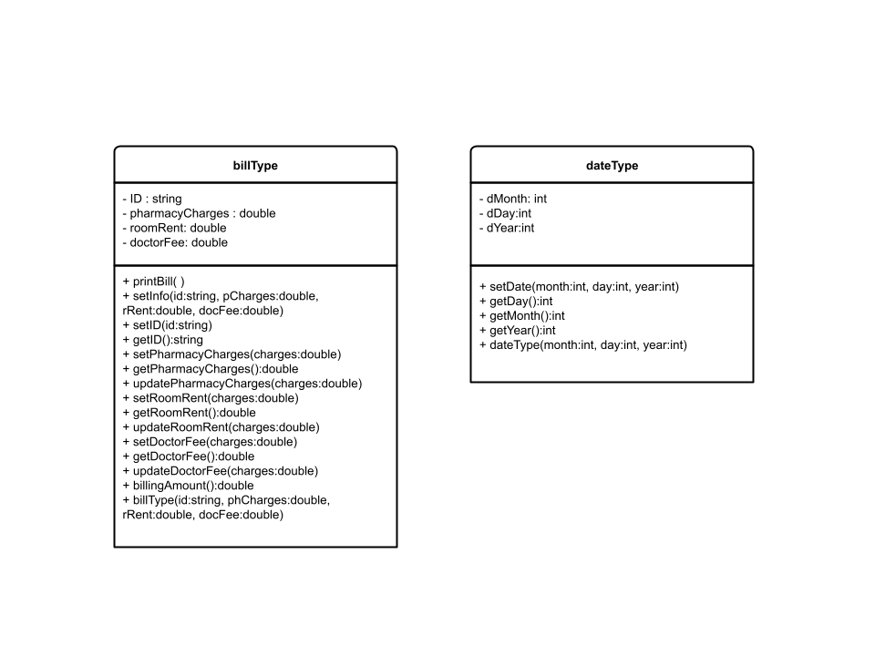

# HW05: Classes and Inheritance

## Firstname Lastname
TODO - Update your name in this readme
TODO - Add github actions badge.

## Problem Statement

In this exercise, you will design various classes and write a program to computerize the billing system of a hospital.
```
class personType {
  public:
    void print() const;
    // Function to output the first name and last name
    // in the form firstName lastName.

    void setName(string first, string last);
    // Function to set firstName and lastName according
    // to the parameters.
    // Postcondition: firstName = first; lastName = last

    string getFirstName() const;
    // Function to return the first name.
    // Postcondition: the value of firstName is returned.

    string getLastName() const;
    // Function to return the last name.
    // Postcondition: the value of lastName is returned.

    personType(string first = "", string last = "");
    // Constructor
    // Sets firstName and lastName according to the parameters.
    // The default values of the parameters are null strings.
    // Postcondition: firstName = first; lastName - last

  private:
    string firstName; // variable to store the first name
    string lastName;  // variable to store the last name
};
```

## Class Organization
Please refer to the UML diagrams of the classes provided. Make sure that you name each member function and data attribute with the signatures indicated in the diagram for your test cases to run in order to receive full credit.


Design the class `doctorType`, inherited from the class `personType`, defined above, with an additional data member to store a doctor's speciality. Add appropriate constructors and member functions (see UML diagram) to initialize, access, and manipulate the data members.



Design the class `billType` with data members to store a patient's ID and a patient's hospital charges, such as pharmacy charges for medicine, doctor's fee, and room charges. Add appropriate constructors and member functions (see UML diagram) to initialize, access, and manipulate the data members.

Design the class `patientType`, inherited from the class `personType`, defined in Chapter 10, with additional data members to store a patient's ID, age, date of birth, attending physician's name, the date when the patient was admitted in the hospital, and the date when the patient was discharged from the hospital. (Use the class `dateType` to store the date of birth, admit date, discharge date, and the class `doctorType` to store the attending physician's name.) Add appropriate constructors and member functions to initialize, access, and manipulate the data members.
